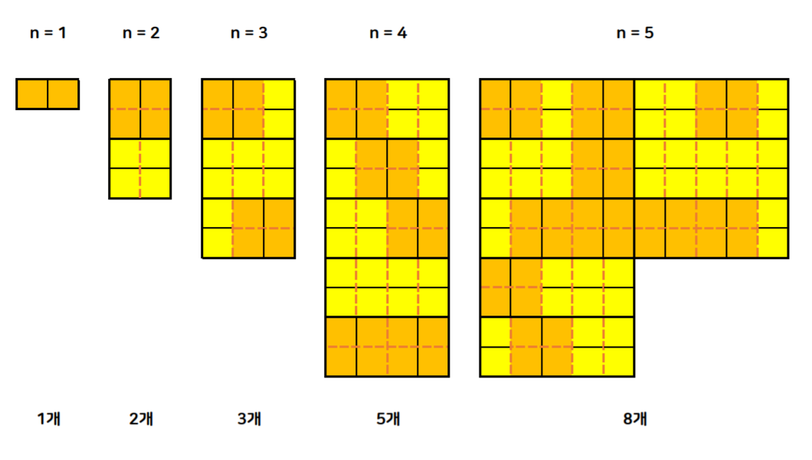

# {{ $frontmatter.title }}

> {{ $frontmatter.description }}

> [!NOTE]
> 이 글은 Obsidian에서 마이그레이션되었으며, 그 과정에서 AI의 도움을 받았습니다.
> 오류나 누락된 내용이 있다면 댓글로 알려주세요!

## 문제

[11726번: 2×n 타일링](https://www.acmicpc.net/problem/11726)

## 풀이

### 아이디어

사실 동일한 문제를 예전에 풀어 본 적이 있어서 점화식은 금방 생각해 낼 수 있었다.

일단 뭔가 일정한 규칙이 있어 보이니 그려보기로 했다.



2×n 크기의 직사각형을 만드는 방법에 2×(n-1) 크기의 직사각형을 만드는 방법과 2×(n-2) 크기의 직사각형을 만드는 방법이 포함되어 있는 것을 알 수 있다. 따라서 다이나믹 프로그래밍을 위한 점화식은 2×n 크기의 직사각형을 만드는 방법을 dp[n]이라고 하면 `dp[n] = dp[n-1] + dp[n-2] (dp[1] = 1, dp[2] = 2)` 라고 세울 수 있다.

그래서 dp[3]부터 시작해서 dp[n]까지 반복문을 돌며 dp 배열을 채워주면 되는데... 주의할 점은 더한 값들을 그대로 넣어주면 정수 범위를 벗어나게 되어 틀린 값이 나온다! 문제에서 요구한 대로 10,007로 나누어준 나머지를 배열에 넣어주자.

이게 가능한 이유는 모듈러 연산의 분배법칙 때문이다.

- (A + B) % p = ((A % p) + (B % p)) % p
- (A _ B) % p = ((A % p) * (B % p)) % p
- (A - B) % p = ((A % p) - (B % p) + p) % p

### 코드

```cpp

/*
2022-2-7
11726_2×n 타일링
https://www.acmicpc.net/problem/11726
*/

#include <iostream>
using namespace std;

int main(){
    ios::sync_with_stdio(false);
    cin.tie(0);
    cout.tie(0);

    int n;
    int dp[1001];

    cin >> n;
    dp[1] = 1;
    dp[2] = 2;

    for(int i = 3; i <= n; i++)
        dp[i] = (dp[i - 1] + dp[i - 2]) % 10007;

    cout << dp[n];

    return (0);
}
```
