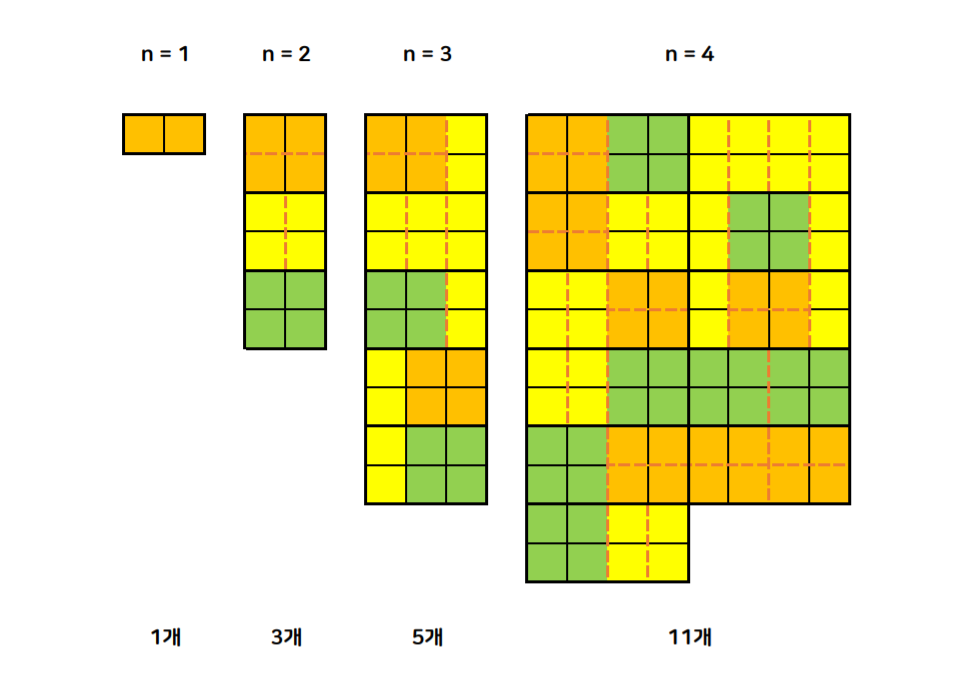

# {{ $frontmatter.title }}

> {{ $frontmatter.description }}

> [!NOTE]
> 이 글은 Obsidian에서 마이그레이션되었으며, 그 과정에서 AI의 도움을 받았습니다.
> 오류나 누락된 내용이 있다면 댓글로 알려주세요!

## 문제

[11727번: 2×n 타일링 2](https://www.acmicpc.net/problem/11727)

## 풀이

### 아이디어

저번에 풀었던 11726번 2×n 타일링 문제와 동일하게 다이나믹 프로그래밍으로 풀면 된다. [11726번 2×n 타일링 풀이](./11726)

역시 동일하게 그림을 그려 보았다.



그림을 그려보니 dp[n]을 2×n 크기의 직사각형을 채우는 방법의 수라고 하면 `dp[n] = dp[n - 1] + (dp[n - 2] * 2)` 라는 점화식을 세울 수 있었다. (2×2 크기의 직사각형을 만드는 방법이 중복을 제외하면 2가지씩 됨.)

그래서 dp[1] = 1, dp[2] = 3을 초깃값으로 두고 세운 점화식대로 dp[3]부터 dp[n]까지 반복문을 돌며 값을 채워나가주면 답을 찾을 수 있다.

역시 그냥 쭉 더해가다보면 정수 범위를 벗어나게 되므로 모듈러의 분배법칙을 활용해서 % 10,007 한 값을 배열에 넣어줘야 런타임에러가 발생하지 않는다.

### 코드

```cpp
/*
2022-2-8
11727_2×n 타일링 2
https://www.acmicpc.net/problem/11727
*/

#include<iostream>
using namespace std;

int main(){
    ios::sync_with_stdio(false);
    cin.tie(0);
    cout.tie(0);

    int n;
    int dp[1001];

    cin >> n;
    dp[1] = 1;
    dp[2] = 3;

    for(int i = 3; i <= n; i++)
        dp[i] = (dp[i - 1] + dp[i - 2] * 2) % 10007;

    cout << dp[n];

    return (0);
}
```
