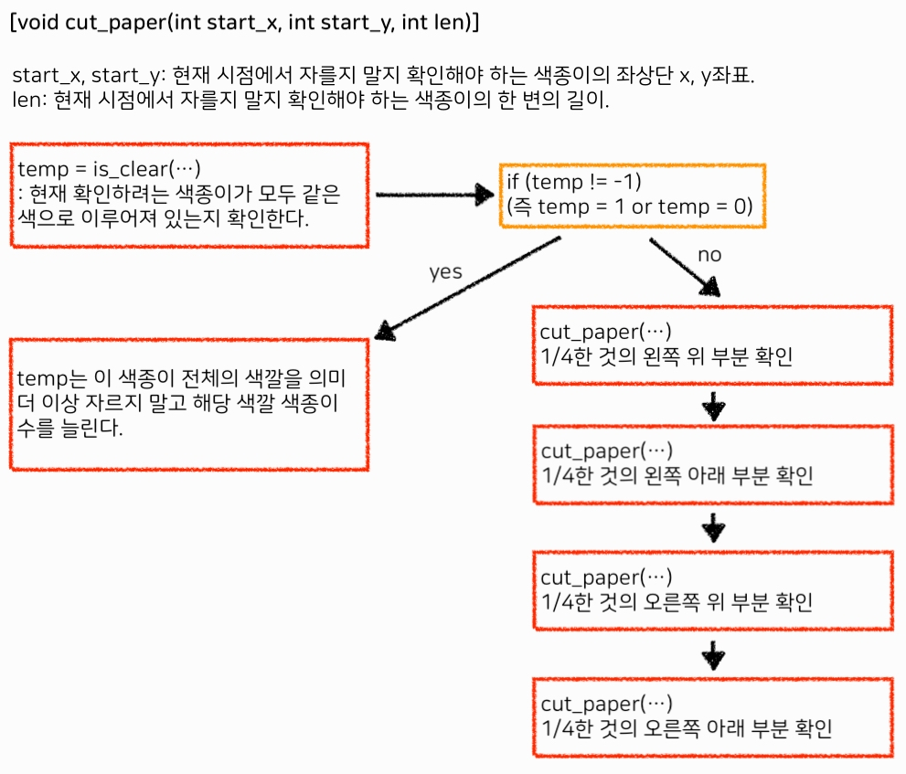

# {{ $frontmatter.title }}

> {{ $frontmatter.description }}

> [!NOTE]
> 이 글은 Obsidian에서 마이그레이션되었으며, 그 과정에서 AI의 도움을 받았습니다.
> 오류나 누락된 내용이 있다면 댓글로 알려주세요!

## 문제

[2630번: 색종이 만들기](https://www.acmicpc.net/problem/2630)

## 풀이

### 아이디어

주어진 종이의 정사각형 칸의 색깔이 모두 같은 색이 아니라면 1/4로 나누어 줘야 한다.

그리고 원래 넓이의 1/4이 된 종이에서 다시 동일하게 정사각형 칸의 색이 모두 같은지 확인하고, 같지 않다면 다시 1/4를 해 주고, 반복하고,...

이렇게 생각해 보면 하나의 문제를 작은 단위 (여기서는 1/4)로 쪼개어서 다시 같은 문제로 반복하는 형태의 문제이기 때문에 Divide and Conquer (분할정복) 방식으로 풀어주면 되겠다.

가장 중심이 되는 (사실 이것밖에 없다고도 할 수 있음) cut_paper 함수의 흐름을 간략하게 정리해 봤는데 이해가 잘 되었으면 좋겠다...



종이 하나를 갖고 쪼갤 수 있을 때 까지 쪼개본다고 생각하면 될 듯 하다.

재귀함수를 좀 오랜만에 짠 것 같은데 그러다보니 종료 조건 부분이 조금 애매하다. `temp != -1` 부분에서 `if - else` 구문보다는 그냥 바로 return 을 해버렸으면 좀 더 직관적이었을 것 같다는 생각이 든다...

### 코드

```cpp
/*
2022-2-2
2630_색종이 만들기
https://www.acmicpc.net/problem/2630
*/

#include <iostream>
using namespace std;

int map[128][128];
int N;
int ans[2] = {0, 0};

void cut_paper(int start_x, int start_y, int len);
int is_clear(int start_x, int start_y, int len);

int main(){
    ios::sync_with_stdio(false);
    cin.tie(0);
    cout.tie(0);

    cin >> N;
    for(int i = 0; i < N; i++){
        for(int j = 0; j < N; j++)
            cin >> map[i][j];
    }

    cut_paper(0, 0, N);

    cout << ans[0] << '\n' << ans[1];

    return (0);
}

void cut_paper(int start_x, int start_y, int len){
    int temp = is_clear(start_x, start_y, len);
    if (temp != -1)
        ans[temp]++;
    else{
        cut_paper(start_x, start_y, len/2);
        cut_paper(start_x, start_y + len/2, len/2);
        cut_paper(start_x + len/2, start_y, len/2);
        cut_paper(start_x + len/2, start_y + len/2, len/2);
    }
}

int is_clear(int start_x, int start_y, int len){
    for(int i = 0; i < len; i++){
        for(int j = 0; j < len; j++){
            if (map[start_y][start_x] != map[start_y + i][start_x + j])
                return (-1);
        }
    }
    return (map[start_y][start_x]);
}
```
