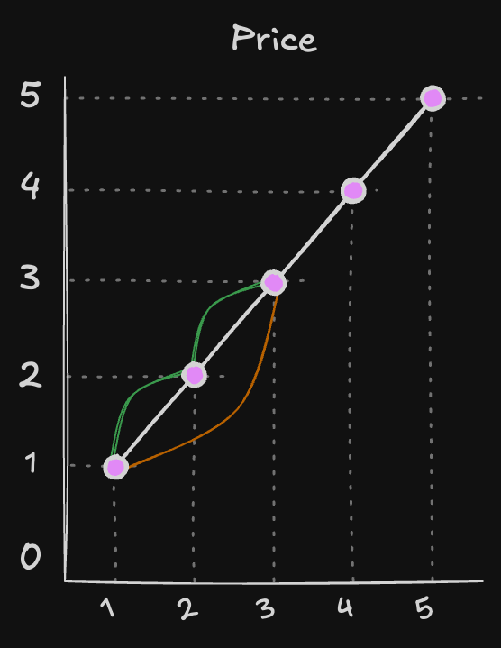

# {{ $frontmatter.title }}

> {{ $frontmatter.description }}

> [!NOTE]
> 이 글은 Obsidian에서 마이그레이션되었으며, 그 과정에서 AI의 도움을 받았습니다.
> 오류나 누락된 내용이 있다면 댓글로 알려주세요!

## 문제

[Best Time to Buy and Sell Stock II - LeetCode](https://leetcode.com/problems/best-time-to-buy-and-sell-stock-ii/)

## 풀이

### 아이디어

~~그리디 문제는 참 어려운 것 같다... 해답을 보면 이렇게 풀면 되겠다 싶은데 해답을 보기 전까지는 '그리디로 푸는게 아닌가?' 싶어도 확신이 안서서 풀지를 못함~~

이 문제에서는 무제한으로 주식을 사고 팔 수 있다. 심지어는 오늘 사서 오늘 팔아도 된다. 중요한 것은 한번에 한주의 주식만 가지고 있을 수 있다는 것이다.

구해야하는 것이 모든 이익을 누적한 총 합이기 때문에 이익이 크든 작든 이익이 발생하는 모든 지점을 놓치지 않는다면 최대 총 이익을 얻을 수 있다. => 요것이 그리디!

이익이 발생할 구간을 (나중에 더 큰 이익이 발생할수도 있으니까... 등등의 이유로) 일부러 건너뛰는 전략은 누적 이익을 구해야 하는 지금의 상황에서는 큰 의미가 없다.



1일차에 사서 2일차에 팔고, 다시 2일차에 사서 3일차에 팔아서 얻는 이익과 1일차에 사서 2일차에 팔지 않고 기다렸다가 3일차에 파는 이익이 동일한 것 처럼 상승 구간에서 발생하는 이익을 모두 더해주면 최대 총 이익이 된다.

### 코드

```typescript
function maxProfit(prices: number[]): number {
  let profit = 0;
  for (let i = 1; i < prices.length; i++) {
    if (prices[i] > prices[i - 1]) {
      profit += prices[i] - prices[i - 1];
    }
  }
  return profit;
};
```


