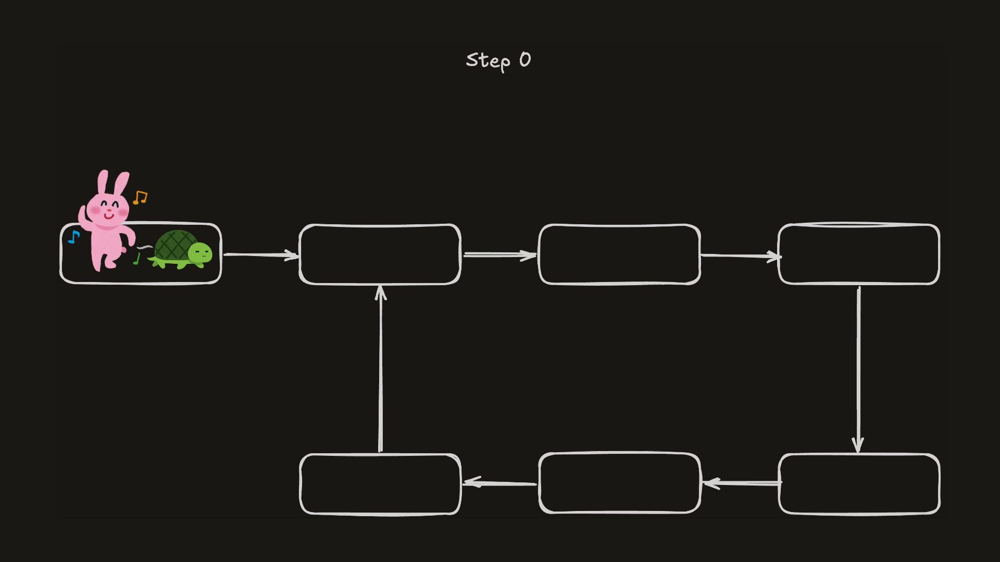

# {{ $frontmatter.title }}

> {{ $frontmatter.description }}

## 문제

[Linked List Cycle](https://leetcode.com/problems/linked-list-cycle)

## 풀이 1

### 문제 이해하기

알고보면 심플한 문제이지만 pos라는 의문의 입력 때문에 조금 혼란을 겪었다. 결론만 정리하면 pos는 리트코드에서 사용하는 파라미터이고 실제로 함수에 제공되지는 않기 때문에 우리가 코드에서 사용할 수는 없다. 따라서 pos값은 무시하고 문제를 풀면 되고, 예제 입력 분석할 때 사이클이 있는지, 없는지를 판단하기 위해서 정도로만 활용하면 된다.

### 아이디어

방문한 노드를 Set에 저장하고, 현재 노드가 이미 Set에 있으면 사이클이 있다고 판단한다. 객체 자체를 Set에 바로 저장했고, 객체의 참조값이 같으면 같은 노드로 판단하기 때문에 추가적인 비교는 필요하지 않다.

### 코드

```typescript
function hasCycle(head: ListNode | null): boolean {
  let cur = head;
  const visited = new Set();

  while (cur !== null) {
    if (visited.has(cur)) return true;
    visited.add(cur);
    cur = cur.next;
  }

  return false;
}
```

### 시간 / 공간 복잡도

- 시간 복잡도: O(n)
- 공간 복잡도: O(n)

## 풀이 2

### 아이디어

가끔 등장하는 리트코드의 도발... "Can you solve it using O(1) (i.e. constant) memory?" 에 걸려서 찾아본 알고리즘이다.

Floyd's Cycle Detection (플로이드 토끼와 거북이) 이라는 귀여운 이름을 가진 알고리즘인데, 순환을 찾는 클래식한 방법이라고 하니 기억해두면 좋을 것 같다.

거북이처럼 느리게 움직이는 포인터 1개와 토끼처럼 빠르게 움직이는 포인터 1개를 만들어서 계속 움직이다 보면 사이클이 존재한다면 둘은 언젠가 만나게 된다는 아이디어다. 그리고 사이클이 없다면 빠르게 움직이는 포인터가 먼저 null에 도달해서 종료된다.



### 코드

```typescript
function hasCycle(head: ListNode | null): boolean {
  let slow = head;
  let fast = head;

  while (fast !== null && fast.next !== null) {
    slow = slow.next;
    fast = fast.next.next; // 2칸씩 이동

    if (slow === fast) return true;
  }

  return false;
}
```

### 시간 / 공간 복잡도

- 시간 복잡도: O(n)
- 공간 복잡도: O(1)
