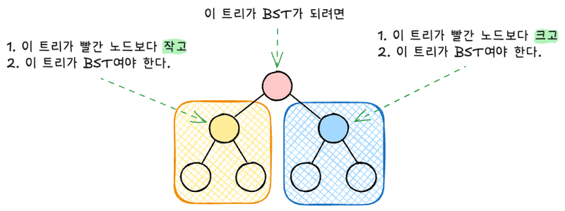
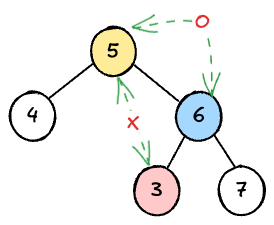

# {{ $frontmatter.title }}

> {{ $frontmatter.description }}

> [!NOTE]
> 이 글은 Obsidian에서 마이그레이션되었으며, 그 과정에서 AI의 도움을 받았습니다.
> 오류나 누락된 내용이 있다면 댓글로 알려주세요!

## 문제

[Validate Binary Search Tree - LeetCode](https://leetcode.com/problems/validate-binary-search-tree/)

## 풀이 - 전위순회

### 아이디어

현재 노드가 root인 tree의 BST 여부는 왼쪽 서브트리가 BST인지와 오른쪽 서브트리가 BST인지를 확인해서 판단할 수 있다. 간단한 내용이지만,, 그림으로 그려보면 아래와 같다.



이 때 중요한 것은 각 서브트리의 모든 노드들이 root 보다 작거나 크거나 해야 한다는 것이다. 단순히 서브트리의 root 노드만 확인하면 안되는 이유는 다음과 같은 케이스에서 확인할 수 있다.



6을 루트로 하는 오른쪽 서브트리는 왼쪽에 3, 오른쪽에 7로 BST의 요건을 달성했지만, 3은 전체 루트 노드인 5보다 작은 값인데 오른쪽 서브트리에 있으므로 전체 트리는 유효한 BST가 아니게 된다.

따라서 BST 여부를 판단할 때 노드들의 범위까지도 함께 고려해줘야 한다.

- 왼쪽 자식 트리의 범위는 "하한"은 계속 유지되고 (음의 무한대), "상한"은 부모 노드의 값으로 업데이트된다.
- 오른쪽 자식 트리의 범위는 "상한"은 계속 유지되고 (양의 무한대), "하한"은 부모 노드의 값으로 업데이트된다.

### 코드

```typescript
class TreeNode {
  val: number;
  left: TreeNode | null;
  right: TreeNode | null;
  constructor(val?: number, left?: TreeNode | null, right?: TreeNode | null) {
    this.val = val === undefined ? 0 : val;
    this.left = left === undefined ? null : left;
    this.right = right === undefined ? null : right;
  }
}

function isValidBST(root: TreeNode | null): boolean {
  // 노드가 하나만 있는 경우를 먼저 처리해줬다.
  if (root === null || (root.left === null && root.right === null)) {
    return true;
  }

  function checkSubTree(
    currNode: TreeNode | null,
    min: number,
    max: number
  ): boolean {
    if (currNode === null) {
      return true;
    }
    if (currNode.val <= min || currNode.val >= max) {
      return false;
    }

    return (
      checkSubTree(currNode.left, min, currNode.val) &&
      checkSubTree(currNode.right, currNode.val, max)
    );
  }

  return checkSubTree(root, -Infinity, Infinity);
}
```

### 시간 / 공간 복잡도

- 시간 복잡도: 모든 노드를 한번씩 확인하므로 O(n)
- 공간 복잡도: 재귀 콜 스택에 의해 결정되며, 최악의 경우 (연결 리스트 형태의 트리) 깊이가 n이 되므로 O(n)
