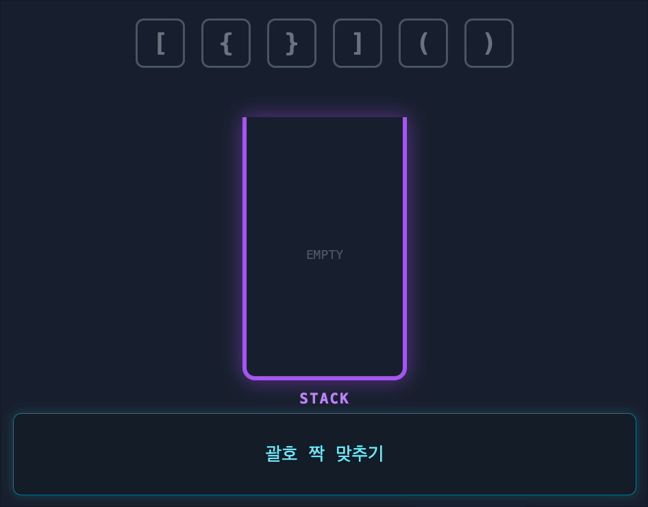
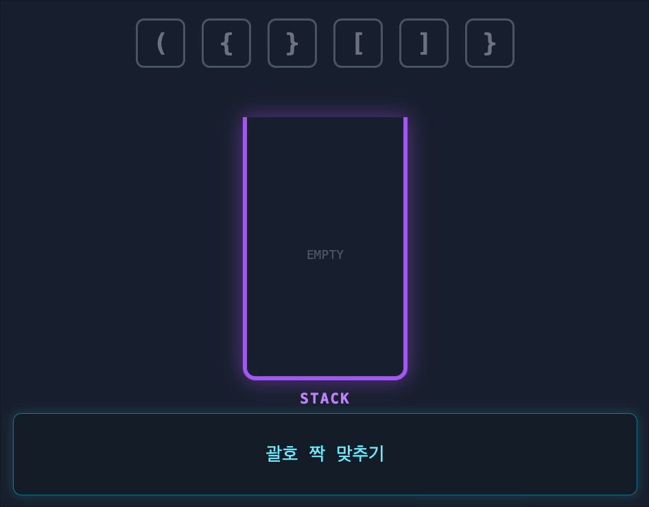

# {{ $frontmatter.title }}

> {{ $frontmatter.description }}

> [!NOTE]
> 이 글은 Obsidian에서 마이그레이션되었으며, 그 과정에서 AI의 도움을 받았습니다.
> 오류나 누락된 내용이 있다면 댓글로 알려주세요!

## 문제

[코딩테스트 연습 - 올바른 괄호 | 프로그래머스 스쿨](https://programmers.co.kr/learn/courses/30/lessons/12909)

## 풀이

### 아이디어

괄호 짝맞추기는 무조건 스택... 여는 괄호가 있으면 스택에 push, 닫는 괄호가 있으면 스택의 top이 있는지, 있다면 짝이 맞는지를 확인해주는 방법인데, 풀이 과정 자체를 눈으로 보면 간단해서 기억하기가 쉽다.





~~gemini야 고맙다...~~

### 코드

```javascript
function solution(s) {
  let stackSize = 0;

  for (const c of s) {
    if (c === "(") {
      // 여는 괄호인 경우 스택에 넣는다
      stackSize++; // 괄호 종류가 하나 뿐이므로 직접 스택에 데이터를 넣을 필요가 없음
    } else {
      // 닫는 괄호인 경우 스택에서 뺀다
      if (stackSize === 0) return false;
      stackSize--;
    }
  }

  return stackSize === 0;
}
```
