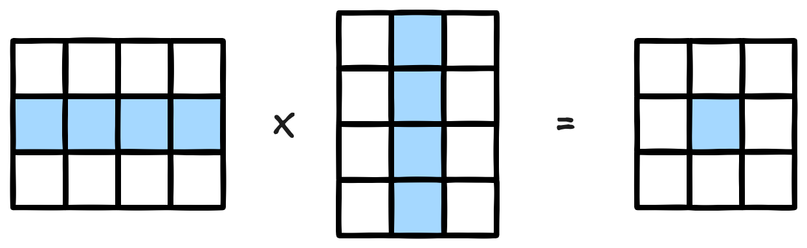

# {{ $frontmatter.title }}

> {{ $frontmatter.description }}

> [!NOTE]
> 이 글은 Obsidian에서 마이그레이션되었으며, 그 과정에서 AI의 도움을 받았습니다.
> 오류나 누락된 내용이 있다면 댓글로 알려주세요!

## 문제

[코딩테스트 연습 - 행렬의 곱셈 | 프로그래머스 스쿨](https://programmers.co.kr/learn/courses/30/lessons/12949)

## 풀이

### 아이디어

행렬의 곱셈을 그대로 구현하면 된다.



### 코드

```javascript
function solution(arr1, arr2) {
    const row1 = arr1.length;
    const col1 = arr1[0].length;
    const row2 = arr2.length;
    const col2 = arr2[0].length;

    // 결과를 저장할 배열 초기화 (row1 * col2)
    const answer = [];
    for (let cnt = 0; cnt < row1; cnt++) {
        answer.push((new Array(col2)).fill(0));
    }

    // 곱셈 시작
    for (let i = 0; i < row1; i++) {
        for (let j = 0; j < col2; j++) {
            for (let k = 0; k < col1; k++) {
                answer[i][j] += arr1[i][k] * arr2[k][j];
            }
        }
    }

    return answer;
}
```

### 시간 복잡도

- 시간 복잡도: 여기서 N은 행과 열의 길이이다. 행과 열의 길이만큼 3중 반복문으로 돌게 되므로 시간 복잡도는 O(N³)이다.
