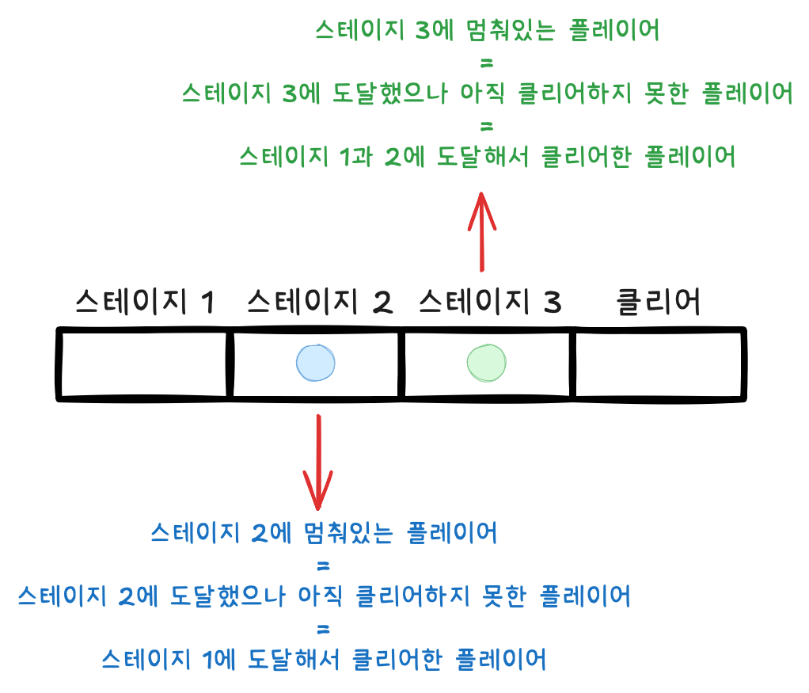
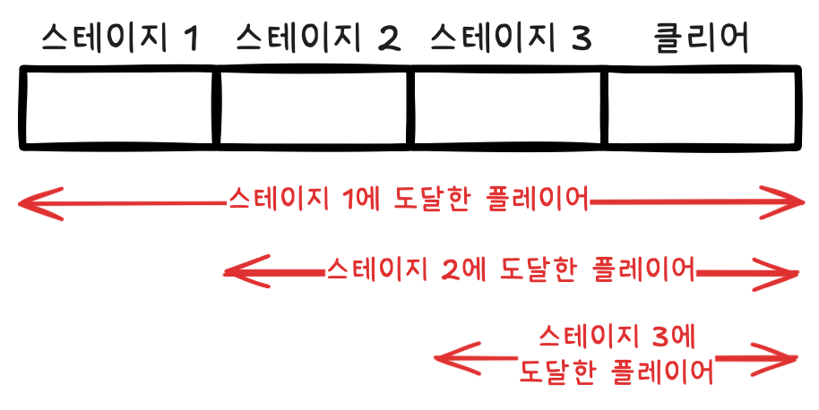

# {{ $frontmatter.title }}

> {{ $frontmatter.description }}

> [!NOTE]
> 이 글은 Obsidian에서 마이그레이션되었으며, 그 과정에서 AI의 도움을 받았습니다.
> 오류나 누락된 내용이 있다면 댓글로 알려주세요!

## 문제

[코딩테스트 연습 - 실패율 | 프로그래머스 스쿨](https://programmers.co.kr/learn/courses/30/lessons/42889)

## 풀이

### 아이디어

공식을 사용하기 위해서 필요한 데이터를 구하는 것이 관건이었던 것 같다. 실패율의 정의는 `스테이지에 도달했으나 아직 클리어하지 못한 플레이어의 수 / 스테이지에 도달한 플레이어 수` 인데, 주어진 데이터는 `플레이어가 현재 멈춰 있는 스테이지의 번호`이다.



스테이지에 도달한 플레이어 수는 누적된 값이라서 괜찮은 방법을 생각하기 좀 어려웠는데, k번째 스테이지에 도달한 플레이어 수는 k번째 스테이지에 도전하고 있는 플레이어 수 + k번째 이후 스테이지에 도전하고 있는 플레이어 수라는 것을 이용해서 풀었다. 첫번째 스테이지에 도달한 플레이어 수는 전체 플레이어일 것이고, 이후부턴 이전 스테이지에 도전중인 플레이어 수를 빼 주면서 구해줬다.



### 코드

```javascript
function solution(N, stages) {
  // k번째 스테이지에 도전중인 플레이어를 구하기
  // N + 2 : 스테이지 번호가 1부터 시작 + 모두 통과한 플레이어도 커버하기 위함
  const stagePlayers = new Array(N + 2).fill(0);
  for (const stage of stages) {
    stagePlayers[stage]++;
  }

  // 실패율 구하기 (여전히 도전중인 플레이어 / 도달한 적이 있는 플레이어)
  const fails = {}; // 실패율
  let totalPlayers = stages.length; // 전체 플레이어의 수

  for (let k = 1; k <= N; k++) {
    if (stagePlayers[k] === 0) {
      // 스테이지에 도달한 유저가 없는 경우 해당 스테이지의 실패율은 0으로 정의한다.
      fails[k] = 0;
    } else {
      fails[k] = stagePlayers[k] / totalPlayers;
      totalPlayers -= stagePlayers[k];
    }
  }

  // fails 정렬하기
  const answer = Object.entries(fails)
    .sort(([_, failRate1], [__, failRate2]) => failRate2 - failRate1)
    .map(([stageNum]) => Number(stageNum));

  return answer;
}
```
