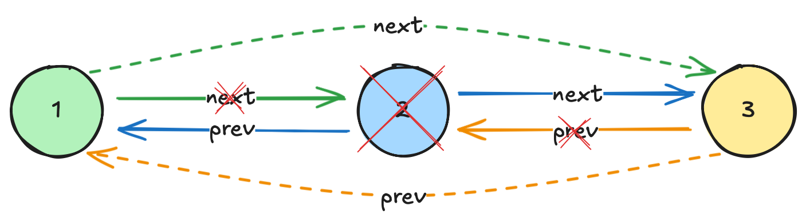
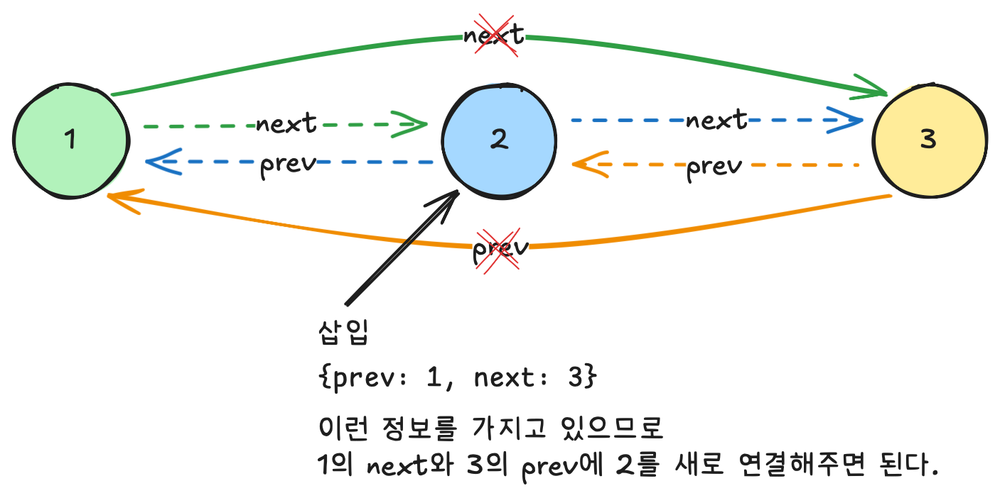

# {{ $frontmatter.title }}

> {{ $frontmatter.description }}

> [!NOTE]
> 이 글은 Obsidian에서 마이그레이션되었으며, 그 과정에서 AI의 도움을 받았습니다.
> 오류나 누락된 내용이 있다면 댓글로 알려주세요!

## 문제

[코딩테스트 연습 - 표 편집 | 프로그래머스 스쿨](https://programmers.co.kr/learn/courses/30/lessons/81303)

## 풀이

### 아이디어

효율성까지 확인하는 문제인데, n의 크기가 최대 1,000,000, cmd의 길이가 최대 200,000이기 때문에 표 데이터를 단순 배열로 관리하면 삭제된 배열도 계속 방문하게 되므로 시간 초과가 발생한다.

그래서 사용한 자료구조는

1. 표 데이터 관리는 이중 연결 리스트 - prev, next 정보를 이용해서 삭제된 열을 빠르게 건너뛰기 위함
2. 삭제 히스토리는 스택

이렇게 2가지를 사용했다.

```javascript
  const row = Array.from({ length: n }, (_, idx) => ({
    prev: idx === 0 ? null : idx - 1, // 이전 행 인덱스. 없으면 null
    isDeleted: false, // 삭제 여부 (정답 만들기 위함)
    next: idx === n - 1 ? null : idx + 1, // 다음 행 인덱스
  }));

  const deleted = []; // 삭제 히스토리 스택. 삭제된 행의 인덱스를 저장한다.
  let cur = k; // 현재 선택된 행
```

다행인 점은 입력 자체에서 범위가 벗어나거나 행이 모두 사라지는 등의 엣지 케이스를 제한한 것이었다. 그래서 "U"나 "D" 명령어는 쉽게 구현할 수 있었고, 개인적으로 좀 까다로웠던 것은 C와 Z명령어이다.

**C 명령어 : 행 삭제**

삭제할 때 중요한 점은 삭제될 노드의 prev/next 정보를 유지한 채로 주변 노드들의 연결만 업데이트해야 한다는 것이다. 이렇게 해야 나중에 Z 명령어에서 복구할 때 정확한 위치를 알 수 있다.

이중 연결 리스트의 삭제는 삭제 대상 노드의 prev와 next를 연결해주면 된다.



```javascript
  case "C":
	// 현재 선택된 행을 삭제
	row[cur].isDeleted = true;
	deleted.push(cur);
	// 현재 선택된 행이 가장 마지막 행인 경우 현재 행을 그 위 행으로
	if (row[cur].next === null) {
	  cur = row[cur].prev;
	  if (cur !== null) row[cur].next = null;
	} else {
	  // 그 외에는 아래 행 선택
	  if (row[cur].prev !== null) row[row[cur].prev].next = row[cur].next;
	  row[row[cur].next].prev = row[cur].prev;
	  cur = row[cur].next;
	}
	break;
```

**D 명령어 : 행 복구**

복구할 때는 저장된 prev/next를 그대로 사용해서 연결해주면 된다.

"삭제된 행의 prev/next가 이미 삭제된 상태면 어떡하지?" 하는 의문을 잠깐 생겼었는데, 스택을 사용하기 때문에 이 문제는 발생하지 않는다.

- 나중에 삭제된 것부터 복구되기 때문에
- 복구 시점에는 참조하는 노드들이 이미 복구되어 항상 살아있다.

구현 자체는 이중 연결 리스트의 삽입 과정을 그대로 구현해주면 되었다.



```javascript
  case "Z":
	// 최근에 삭제된 것 복구
	const deletedIdx = deleted.pop();
	if (deletedIdx === undefined) break;
	if (row[deletedIdx].prev !== null)
	  row[row[deletedIdx].prev].next = deletedIdx;
	if (row[deletedIdx].next !== null)
	  row[row[deletedIdx].next].prev = deletedIdx;
	row[deletedIdx].isDeleted = false;
	break;
```

### 코드

```javascript
function solution(n, k, cmd) {
  const row = Array.from({ length: n }, (_, idx) => ({
    prev: idx === 0 ? null : idx - 1,
    isDeleted: false,
    next: idx === n - 1 ? null : idx + 1,
  }));

  const deleted = [];
  let cur = k;
  for (let idx = 0; idx < cmd.length; idx++) {
    const [op, argstr] = cmd[idx].split(" ");
    const arg = Number(argstr);
    switch (op) {
      case "U":
        for (let cnt = 0; cnt < arg; cnt++) {
          cur = row[cur].prev;
        }
        break;
      case "D":
        for (let cnt = 0; cnt < arg; cnt++) {
          cur = row[cur].next;
        }
        break;
      case "C":
        // 현재 선택된 행을 삭제
        row[cur].isDeleted = true;
        deleted.push(cur);
        // 현재 선택된 행이 가장 마지막 행인 경우 현재 행을 그 위 행으로
        if (row[cur].next === null) {
          cur = row[cur].prev;
          if (cur !== null) row[cur].next = null;
        } else {
          // 그 외에는 아래 행 선택
          if (row[cur].prev !== null) row[row[cur].prev].next = row[cur].next;
          row[row[cur].next].prev = row[cur].prev;
          cur = row[cur].next;
        }
        break;
      case "Z":
        // 최근에 삭제된 것 복구
        const deletedIdx = deleted.pop();
        if (deletedIdx === undefined) break;
        if (row[deletedIdx].prev !== null)
          row[row[deletedIdx].prev].next = deletedIdx;
        if (row[deletedIdx].next !== null)
          row[row[deletedIdx].next].prev = deletedIdx;
        row[deletedIdx].isDeleted = false;
        break;
    }
  }

  const answer = row.reduce(
    (acc, { isDeleted }) => (acc += isDeleted ? "X" : "O"),
    ""
  );
  return answer;
}
```
