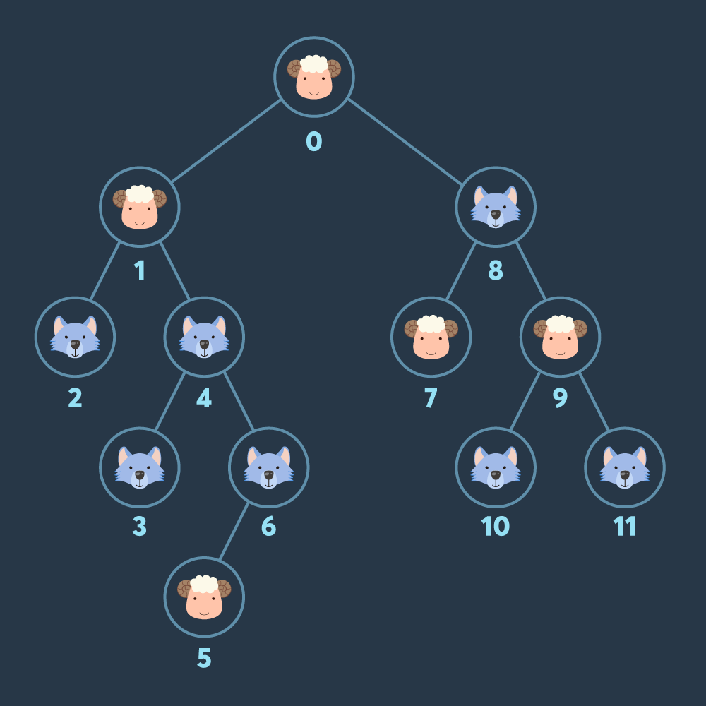

# {{ $frontmatter.title }}

> {{ $frontmatter.description }}

> [!NOTE]
> 이 글은 Obsidian에서 마이그레이션되었으며, 그 과정에서 AI의 도움을 받았습니다.
> 오류나 누락된 내용이 있다면 댓글로 알려주세요!

## 문제

[코딩테스트 연습 - 양과 늑대 | 프로그래머스 스쿨](https://programmers.co.kr/learn/courses/30/lessons/92343)

## 풀이

### 아이디어

DFS와 백트래킹이 합쳐진 문제이다. 모든 가능한 경로를 탐색하지만 양 > 늑대 조건을 만족하는 경로일 때만 계속 진행한다.

일반적인 DFS에서는 부모에서 자식으로 가는 한 방향으로만 진행하고, 방문한 노드는 재방문하지 않지만 이 문제에서는



```
0번 노드 방문 -> 방문 가능한 노드: {1, 8}
1번 노드 방문 -> 방문 가능한 노드: {8, 2, 4}
4번 노드 방문 -> 방문 가능한 노드: {8, 2, 3, 6}
```

이런 식으로 다시 부모 노드로 돌아가 형제 노드로도 이동할 수도 있다. 이렇게 현 시점에서 다음에 방문 가능한 노드들을 possible 이라는 Set으로 관리했다.

- 방문한 노드는 이미 방문했기 때문에 possible에서 제거하고
- 해당 노드의 자식들을 possible에 추가한다.

### 코드

```javascript
function solution(info, edges) {
  let answer = 0;
  const nodeCount = info.length;
  // parent-children 관계 정리
  const tree = Array.from({length: nodeCount}, () => []);
  edges.forEach(([parent, child]) => tree[parent].push(child));

  // dfs (양 수집)
  // current: 이번에 방문할 노드
  // sheep: 현재 양 수
  // wolf: 현재 늑대 수
  // possible: 방문할 수 있는 다른 노드들 (현재 노드 포함)
  function dfs(current, sheep, wolf, possible) {
      const [newSheep, newWolf] = info[current] ? [sheep, wolf + 1] : [sheep + 1, wolf];
      // 만약 양이 늑대보다 많지 않다면 게임 오버 (바로 리턴한다.)
      if (newSheep <= newWolf) {
          return;
      }

      // 양의 수 업데이트(더 많은 것으로 업데이트한다.)
      answer = Math.max(answer, newSheep);
      // 방문 가능 목록 업데이트하기 (이미 방문한 곳은 제거)
      const newPossible = new Set(possible);
      newPossible.delete(current);
      tree[current].forEach((child) => newPossible.add((child)))
      // 방문 가능한 모든 노드 시도
      newPossible.forEach((next) => dfs(next, newSheep, newWolf, newPossible));
  }

  dfs(0, 0, 0, new Set([0]))
  return answer;
}
```
